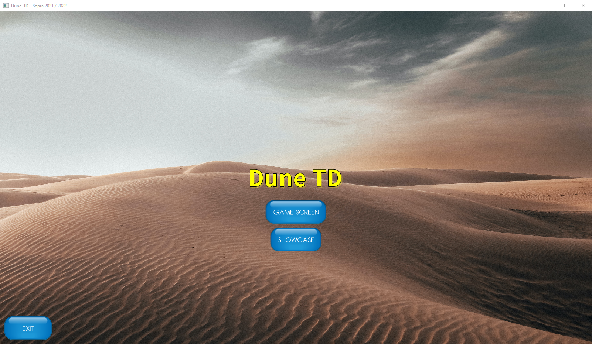
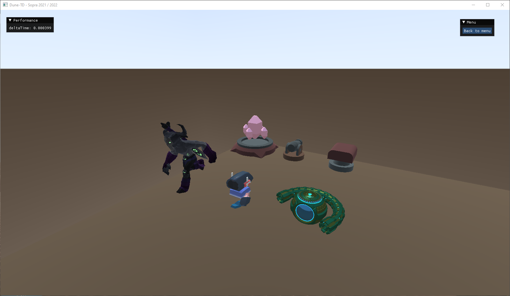
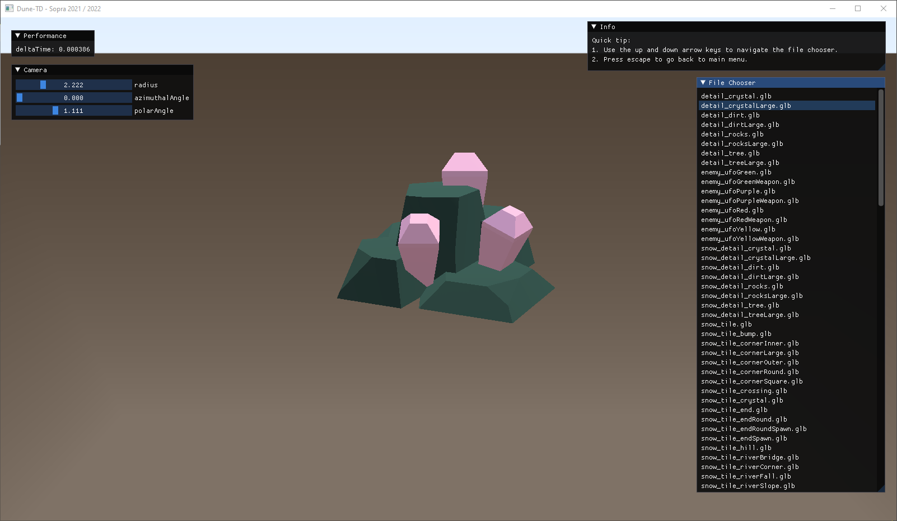
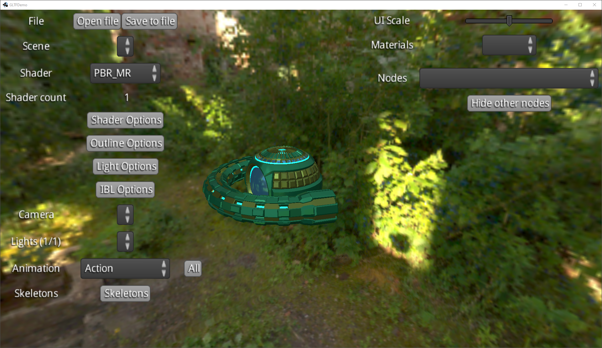

# Dune-TD (Template)

This is the Dune-TD template provided by Dennis Jehle for your implementation of Dune-TD. Feel free to modify the template. If you want to use another framework or programming language, please contact your tutor.

## Requirements

The template was tested with `OpenJDK Runtime Environment Temurin-11.0.12+7 (build 11.0.12+7)` on:

* Windows 10
* Linux

Link to the used JDK: [https://adoptium.net/?variant=openjdk11](https://adoptium.net/?variant=openjdk11)

## Useful resources

[https://libgdx.com/](https://libgdx.com/)

[https://github.com/libgdx/libgdx](https://github.com/libgdx/libgdx)

[https://github.com/libgdx/libgdx/wiki](https://github.com/libgdx/libgdx/wiki)

[https://libgdx.badlogicgames.com/ci/nightlies/docs/api/](https://libgdx.badlogicgames.com/ci/nightlies/docs/api/)

[https://libgdx.com/community/](https://libgdx.com/community/)

[https://github.com/czyzby/gdx-skins](https://github.com/czyzby/gdx-skins)

[https://github.com/mgsx-dev/gdx-gltf](https://github.com/mgsx-dev/gdx-gltf)

[https://github.com/SpaiR/imgui-java](https://github.com/SpaiR/imgui-java)

[https://github.com/TooTallNate/Java-WebSocket](https://github.com/TooTallNate/Java-WebSocket)

[https://github.com/google/gson](https://github.com/google/gson)

[https://unsplash.com/](https://unsplash.com/)

[https://itch.io/game-assets](https://itch.io/game-assets)

[https://sketchfab.com/features/free-3d-models](https://sketchfab.com/features/free-3d-models)

[https://en.wikipedia.org/wiki/Spherical_coordinate_system](https://en.wikipedia.org/wiki/Spherical_coordinate_system)

[https://www.kenney.nl/assets/tower-defense-kit](https://www.kenney.nl/assets/tower-defense-kit)

[https://www.kenney.nl/assets/tower-defense-top-down](https://www.kenney.nl/assets/tower-defense-top-down)

In the `tools` folder there is a GLTF model viewer provided by [https://github.com/mgsx-dev/gdx-gltf](https://github.com/mgsx-dev/gdx-gltf) to check if the GLTF files are working:

## Licenses

Have a look at the `core/assets/licenses` folder to see the licenses for the used game assets. If you add something new to the template, make sure to provide the licenses for your game assets.
