# Lastenheft **Dune TD**

Version 1.4 vom 08.11.2021

[TOC]

## Anpassung vom 08.11.2021

Betrifft Türme, Highscore, Klopfer:

Türme welche durch den Shai-Hulud (Sandwurm) zerstört werden, bleiben bis zur nächsten Bauphase als inaktive für Feineinheiten nicht passierbare Trümmerhaufen zurück. Die Trümmerhaufen werden automatisch zu Beginn der Bauphase entfernt, insofern kein neuer Turm auf die freigewordene Fläche platziert wird, ist diese wieder für Feindeinheiten passierbar.

Die Highscore ist beliebig aber deterministisch zu bilden und muss eine Ganzzahl sein (32bit Integer).

Da maximal ein Sandwurm pro Runde herangelockt werden kann, kann man auch maximal zwei Klopfer platzieren. Das platzieren von drei oder mehr Klopfern um den Sandwurm zu lenken ist nicht erwünscht.

## Anpassung vom 07.11.2021

Betrifft Türme:

Türme dürfen nur vor der ersten und zwischen den Wellen abgerissen werden.

## Anpassung vom 06.11.2021

Betrifft Spieldurchlauf:

Der Spieldurchlauf findet auf einem in seinen Dimensionen gleichbleibenden Spielfeld statt.

Das Start- und Endportal sind statisch, sie ändern somit nicht ihren Ort während eines Spieldurchlaufes.

Die endliche Anzahl an Gegnerwellen können sich in der Anzahl und Kombination der Feindeinheiten unterscheiden.

## Anpassung vom 05.11.2021

Betrifft Klopfer, Türme und Feindeinheiten:

Während Feindeinheiten vom Startportal zum Endportal laufen können nicht gebaut werden:

* Geschützturm
* Bombenturm
* Schallturm

diese können nur vor der ersten Welle und zwischen den Wellen gebaut werden.

Klopfer um den Sandwurm heranzulocken können jederzeit platziert werden, Sinn macht die Platzierung in der Regel allerdings nur während eine Feindwelle aktiv ist.

Klopfer können sowohl auf Kacheln mit Feindeinheiten als auch auf Kacheln mit Türmen platziert werden, es dürfen nur keine zwei Klopfer auf der selben Kachel platziert werden und die Klopfer müssen in der selben Reihe/Spalte platziert werden.

## Anpassung vom 03.11.2021

Betrifft Wegfindung: 

Der Pfad zwischen Start und Endportal soll immer dann neu berechnet werden, wenn:

1. ein Turm gebaut wird
2. ein Turm zerstört wird (durch Sandwurm)

## Motivation

Dieses Lastenheft beschreibt die Anforderungen an das Einzelspielerspiel **Dune TD**, welches über einen Zeitraum von einem Semester entwickelt werden soll.

**Spoiler Alert: Der nachfolgende Text nimmt Bezug auf das Dune-Universum und somit auch auf den Film Dune (2021). Bei der Erstellung wurde darauf geachtet, dass die eigentliche Filmhandlung nicht gespoilert wird. Es wird empfohlen, den Film zusammen mit den Teamkolleginnen und Teamkollegen im Kino anzuschauen und dann die Bearbeitung des Einzelprojekts zu beginnen.**

Wir befinden uns auf Arrakis, dem Wüstenplaneten, wir schreiben das Jahr 10191. Der von den Harkonnen bewirtschaftete Planet ist der einzige Ort im Universum, an welchem Spice zu finden ist.

Spice ist für die interstellare Raumfahrt das, was Öl für die Menschheit auf der Erde vor ihrer Vernichtung war, wertvoll und unverzichtbar. Das farblich an Zimt erinnernde Pulver ist für die sichere Navigation der Raumschiffe unerlässlich, da es die Navigatoren in die Zukunft blicken lässt, die dadurch auf Gefahren rechtzeitig reagieren können. Auch hat das bei jeder Einnahme anders schmeckende Gewürz die Fähigkeit, das Leben zu verlängern, doch es macht die Konsumenten stark abhängig, diese Abhängigkeit ist ähnlich der von Heroin. Die Konsumenten erkennt man an ihren Augen, denn Spice färbt die sonst weiße Lederhaut im Auge blau.

Das kostbare Spice wird von Sandwürmern produziert, die auch dazu beigetragen haben, den Wüstenplanet noch wasserärmer und lebensfeindlicher zu machen. So wichtig die Sandwürmer durch ihre Gewürzproduktion für das Universum sind, so gefährlich sind sie für alles Lebendige auf Arrakis. So lockt dar rhythmische, fast lautlose Gang einer Person noch kilometerweit entfernte Shai-Hulud (Sandwürmer; wörtlich "Der alte Mann") an. Die braungrauen Shai-Hulud können in ihrem adulten Entwicklungsstadium mehrere Kilometer lang werden und fressen alles, was ihren Weg kreuzt, dabei machen sie keinen Unterschied zwischen einem Menschen und einer riesigen Erntemaschine.

Die Fremen, sozusagen die Ureinwohner von Arrakis, haben über die Zeit gelernt, wie man auf einem todbringenden Sandwurm reitet. Der angelockte Wurm wird mittels Hacken bestiegen und dann durch offenhalten der Ringsegmente dazu gezwungen, über der Sandoberfläche zu bleiben, hierdurch können die Fremen große Strecken in kurzer Zeit überqueren. Die Fremen wurden seit ihrer Existenz verfolgt und versklavt, erst als sie nach Arrakis geflüchtet sind, fühlten sie sich frei. Sie bezeichnen sich als "free men", woraus sich die Bezeichnung Fremen ableitet. Arrakis selbst bezeichnen die Fremen als Dune.

Wegen seiner wirtschaftlichen Bedeutung wird die neue Heimat der Fremen durchgehend von Adelsfamilien besetzt, die wie im Fall der Harkonnen zynischerweise die Fremen wieder in die Rolle der unterdrückten und verdrängten verfrachtet. Nach der nun bereits 80 Jahre andauernden Schreckensherrschaft der sadistischen Harkonnen gibt der Imperator den Befehl, dass das Haus Harkonnen Arrakis an das Haus Atreides abzugeben hat. Die Harkonnen sind über diesen Befehl wenig erfreut, doch sie werden ihn ausführen müssen.

Um den unausweichlichen Machtverlust durch die finanziellen Einbußen abzuschwächen, versuchen die Harkonnen in den von den Fremen kontrollierten Bereichen noch so viel Spice zu ernten wie möglich. Doch die Fremen sehen sich nicht länger in der Rolle der Unterdrückten und sind bereit, gegen die grausamen Besetzer ins Feld zu ziehen. Mithilfe von Geschütz-, Schall- und Bombentürmen bereiten sie den Harkonnen einen todbringenden Empfang und an Fronten, an welchen der Kampf zu scheitern droht, bringt der Einsatz des Shai-Hulud als Geheimwaffe den eventuell entscheidenden Vorteil.

Für die Frauen, Männer und Kinder der Fremen, auf das sie ihre **Freiheit** zurückgewinnen mögen.

## Produkt und Einsatzszenarien

Im Wintersemester 2021 / 2022 soll das Einzelspielerspiel **Dune TD** entwickelt werden. In diesem Kapitel wird die Architektur des Systems beschrieben. Des Weiteren werden die Komponenten des Systems beschrieben und technische Vorgaben gemacht.

Bei einer Tower-Defense (TD) werden Feinde von Türmen beschossen. Die feindlichen Einheiten versuchen von einem Eingangsportal auf einem schachbrettartigen Spielfeld zu einem Ausgangsportal zu gelangen, gelingt ihnen das, verliert der Spieler an Lebenspunkten, wenn diese aufgebraucht sind, verliert er das Spiel. Durch das geschickte platzieren von Türmen auf dem Spielfeld lässt sich der zurückzulegende Weg der feindlichen Einheiten verlängern und somit der Schaden gegen die Feindeinheiten maximieren. Nur durch eine durchdachte Kombination verschiedener Turmarten lassen sich die heranstürmenden Gegnerwellen besiegen. Nach dem Sieg über eine Gegnerwelle bleibt dem Spieler nur wenig Zeit zu verschnaufen, da in der Regel die nächste Welle an Kontrahenten bereits unterwegs ist. Neue Türme müssen gebaut und in die bestehenden Verteidigungslinien integriert werden, bis die nächsten Gegner auf der Jagd nach dem Spice durch das Eingangsportal einfallen.

### Komponenten und Architektur

Bei **Dune TD** handelt es sich um ein lokales Einzelspielerspiel. Zur Übermittlung eines Highscores an einen online Server wird eine Client-Server-Architektur verwendet.

#### Server

Der Highscore-Server wird von Ihnen implementiert. Der Server hat die Aufgabe die Spielhistorie zu persistieren. Hierfür kommuniziert der Server mit dem Client über das im Netzwerkstandard vorgegebene Protokoll.

#### Client

Der Client wird vom Spieler bedient und übermittelt das Ergebnis einer abgeschlossenen Spielpartie an den Server.

### Anwendungssprache, Implementierungssprache und Dokumentationssprache

Die Anwendungssprache ist deutsch oder englisch.

Die Implementierungssprache ist englisch.

Die Dokumentationssprache ist deutsch oder englisch.

### Programmiersprachen und Technologien

Die empfohlene Programmiersprache zur Implementierung von **Dune TD** ist [Java](https://docs.oracle.com/en/java/javase/11/).

Das empfohlene Framework zur Realisierung der graphischen Oberfläche ist [libGDX](https://libgdx.com/).

Falls Sie eine andere Programmiersprache oder ein anderes Framework verwenden möchten, dann besprechen Sie dies mit Ihrem Tutor / Ihrer Tutorin. Die Verwendung einer anderen Programmiersprache oder eines anderen Frameworks ist nur nach ausdrücklicher Erlaubnis Ihrer Tutorin / Ihres Tutors zulässig, da Ihre finale Abgabe von der entsprechenden Person korrigiert werden wird.

Die Verwendung einer [Game Engine](https://www.gameenginebook.com/index.html) (wie zum Beispiel: [Unity](https://en.wikipedia.org/wiki/Unity_(game_engine)), [Unreal](https://en.wikipedia.org/wiki/Unreal_Engine), [CryEngine](https://en.wikipedia.org/wiki/CryEngine), [Godot](https://en.wikipedia.org/wiki/Godot_(game_engine))) ist **nicht** zur Umsetzung von **Dune TD** gestattet, da eine solche Engine zu viel Komplexität abstrahiert. Gerade da es sich bei Dune TD um ein kleines, recht "einfaches" Projekt handelt, soll man sich hier mal selbst die Hände schmutzig machen. Sollte die diesen Text lesende Person anderer Meinung sein, soll sie sich an den Übungsleiter per Mail an dennis.jehle@uni-ulm.de wenden, dieser ist gespannt darauf ihre Meinung zu hören.

### Plattformen

Ihre Anwendung muss mindestens auf einer der nachfolgenden Plattformen lauffähig sein:

* Windows 10
* Linux

Besprechen Sie mit Ihrem Tutor / Ihrer Tutorin eventuell weitere Plattformeinschränkungen oder zusätzlich erlaubte Plattformen wie zum Beispiel macOS.

Auch hier gilt, Ihr Tutor / Ihre Tutorin muss in der Lage sein Ihre finale Abgabe auszuführen.

### Netzwerkkommunikation und Nachrichtenprotokoll

Durch das Zerstören von Feinden verdient der Spieler Highscorepunkte, durch den Verlust von Lebenspunkten oder den Abriss von Türmen verliert der Spieler Highscorepunkte. Eine genaue Beschreibung der Highscorebildung ist im Abschnitt Spielregeln zu finden. Endet das Spiel durch eine Siegbedingung oder durch Niederlage, ergibt sich eine finale Punktzahl. Diese Punktzahl muss vom Client an den Highscore-Server übertragen werden. Hierfür müssen Nachrichten zwischen Client und Server ausgetauscht werden.

Zum Austausch der Nachrichten müssen JSON kodierte Strings über eine WebSocket Verbindung gesendet werden.

**Das Nachrichtenformat wird in einem Netzwerkstandarddokument spezifiziert, welches Sie rechtzeitig erhalten werden.**

## Spielregeln von **Dune TD**

Dieses Kapitel beschreibt die Regeln und den Spielablauf des Spiels **Dune TD**.

### Teilnehmeranzahl

Das Spiel **Dune TD** kann gleichzeitig von genau einem Spieler gespielt werden.

### Spielfeld

Das Spielfeld ist schachfeldartig, es muss allerdings nicht quadratisch sein. Das kleinste zulässige Spielfeld hat eine Größe von zwei auf zwei Kacheln. Obwohl von der Kachelanzahl identisch ist eine ein auf vier Kacheln große Spielfläche unzulässig, da hier keine Türme regelkonform platziert werden können. Nachfolgend einige Beispiele für zulässige und unzulässige Spielfeldkonfigurationen.

Zulässig (und gleichzeitig minimal):

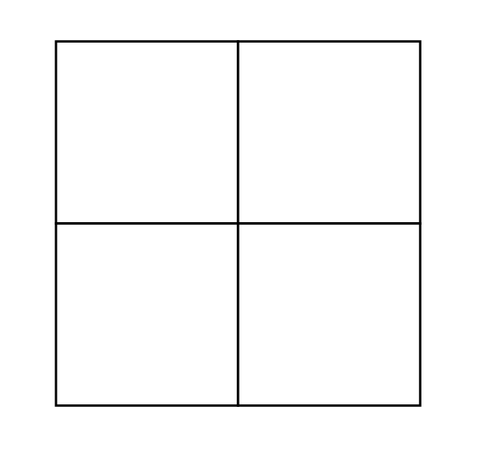

Unzulässig:

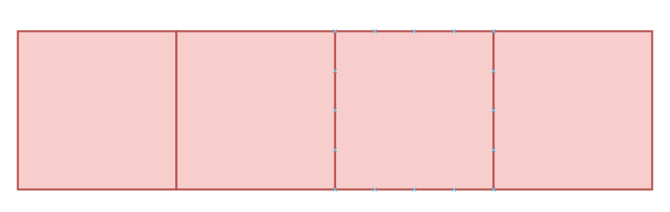

Zulässig:

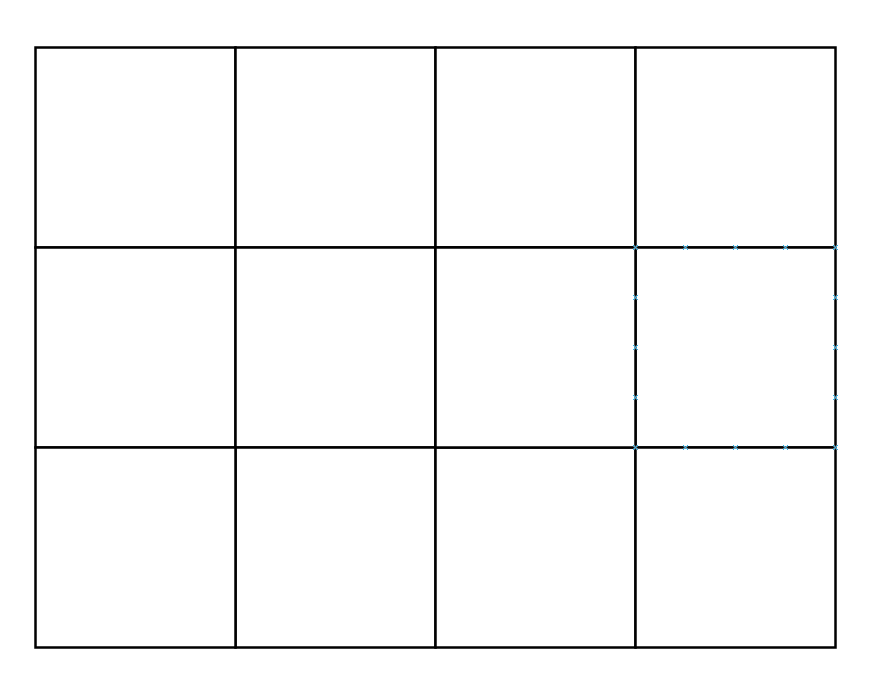

Unzulässig:

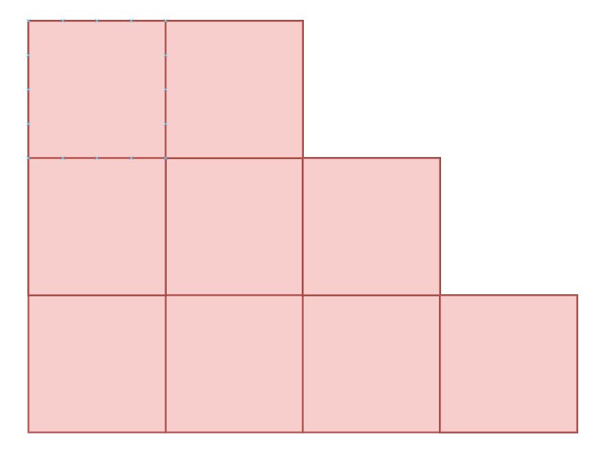

### Portale

Es gibt zwei Arten von Portalen, Startportale und Endportale. Durch ein Startportal betreten Feindeinheiten das Spielfeld und durch ein Endportal verlassen sie es wieder. Das Erreichen eines Endportals hat Auswirkung auf die Lebenspunkte, mehr dazu im Abschnitt Sieg und Niederlage. Zwischen Start- und Endportal muss mindestens eine Kachel liegen. Nachfolgend ein paar Beispiele.

Zulässig:

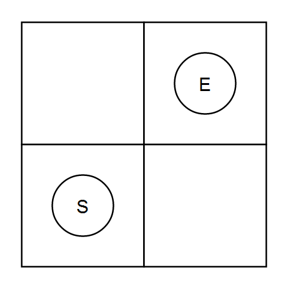

Unzulässig:

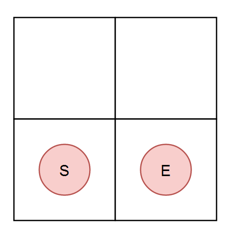

Zulässig:

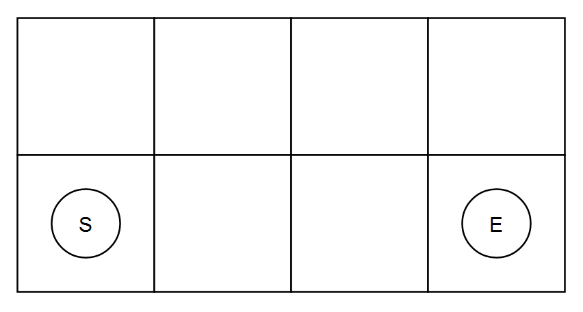

### Türme

Türme bekämpfen heraneilende Harkonnen und ihre Erntemaschinen, indem sie ihnen Schaden zufügen oder andere Effekte wirken. Türme werden auf dem Spielfeld platziert. Hierbei gilt:

1. Ein Turm nimmt die Fläche von genau einer Kachel ein, dies bedeutet, eine Kachel, die von einem Turm besetzt ist, kann nicht mehr als Laufweg genutzt werden, mehr dazu im Abschnitt Feindeinheiten.
2. Es darf nur ein Turm gleichzeitig auf einer Kachel stehen.
3. Türme dürfen nur so platziert werden, dass zu jedem Zeitpunkt ein Laufweg zwischen Start- und Endportal existiert, mehr dazu im Abschnitt Feindeinheiten.
4. Türme dürfen nicht auf Start- und oder Endportal platziert werden.

#### Der Geschützturm

Der Geschützturm zeichnet sich durch seine hohe Kadenz (Schussfrequenz) aus. Er richtet vor allem bei Infanterieeinheiten großen Schaden an.

#### Der Bombenturm

Der Bombenturm wirft Bomben, welche Flächenschaden verursachen. Er hat eine recht geringe Kadenz und ist deshalb eher für feindliche Erntemaschinen gefährlich.

#### Der Schallturm

Beim Schallturm handelt es sich um einen sogenannten Effektturm, durch Schallwellen verwandelt dieser den Sand in seinem Wirkungsbereich in Treibsand. Dadurch werden Infanterieeinheiten verlangsamt, auf die in der Luft schwebenden Erntemaschinen hat der Schallturm nur eine reduzierte Wirkung.

#### Der Shai-Hulud (Sandwurm)

Der Sandwurm ist die Geheimwaffe der Fremen, durch die Platzierung von zwei sogenannten Klopfern wird dieser angelockt. Die Klopfer müssen dabei in unterschiedlichen Kacheln, aber in derselben Reihe beziehungsweise Spalte platziert werden. Der Sandwurm frisst dann alles, was sich in dieser Reihe befindet inklusive Türme, aber exklusive Start- und Endportale und Kacheln. Er kann in unregelmäßigen Abständen herangelockt werden, allerdings nicht öfter als einmal pro Welle, mehr zu Wellen findet man im Abschnitt Wellen.

#### Turmkosten

Türme können nicht kostenlos gebaut werden, das bauen von Türmen kostet Spice, welches zu Spielbeginn bereits in geringen Mengen auf dem Spielerkonto vorhanden sein und von Feindeinheiten erbeutet werden kann. Das Zerstören von Türmen liefert einen geringen Prozentsatz der initialen Baukosten zurück. Nur der Shai-Hulud ist ein kostenloser Spezialturm, welcher wie beschrieben in unregelmäßigen Abständen herangelockt werden kann.

#### Beispielkonfigurationen

Zulässig:

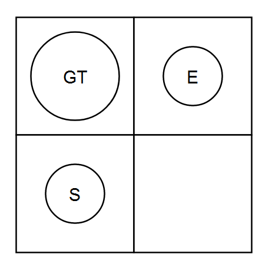

Unzulässig:

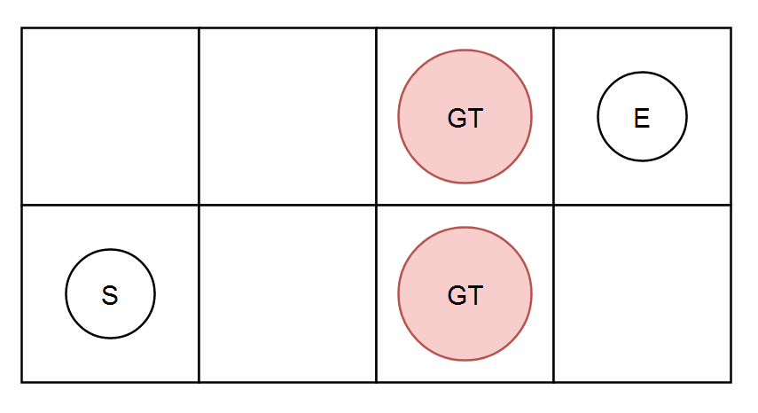

Zulässig:

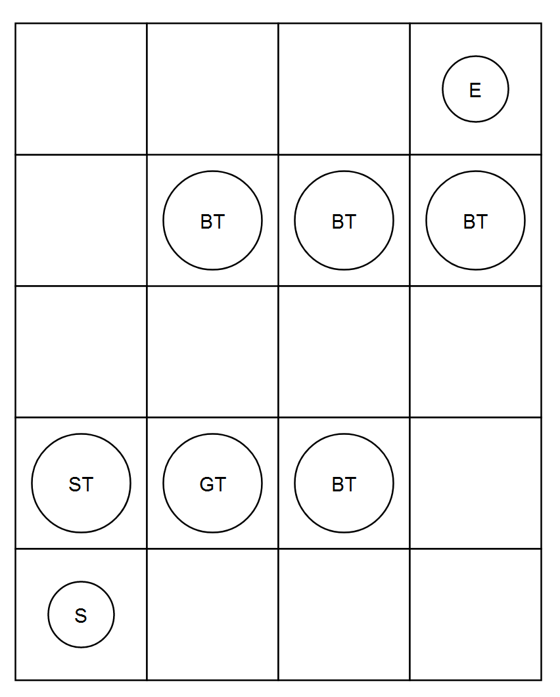

Zulässig:

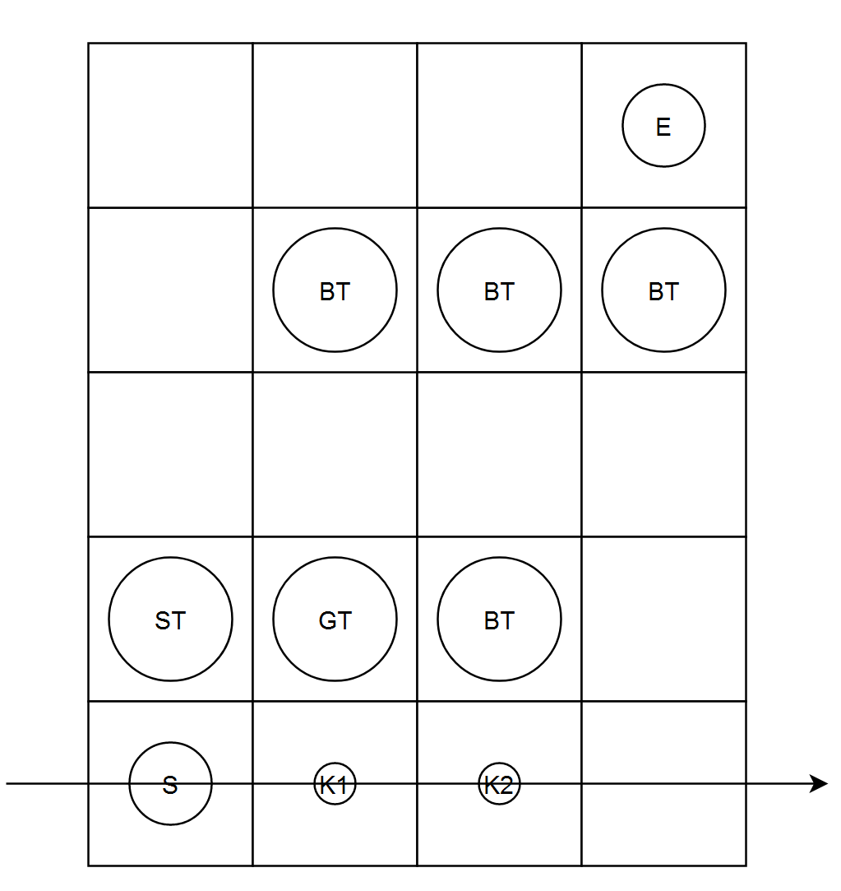

Zulässig:

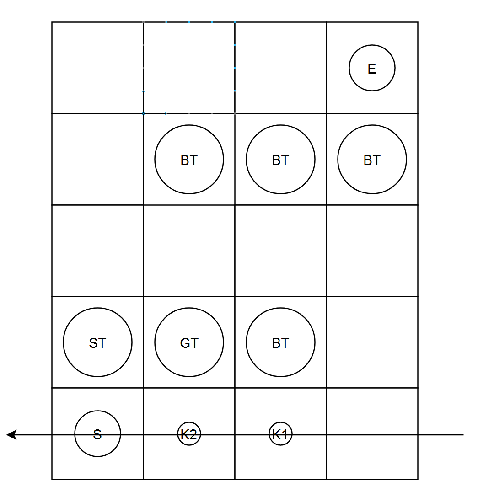

Zulässig:

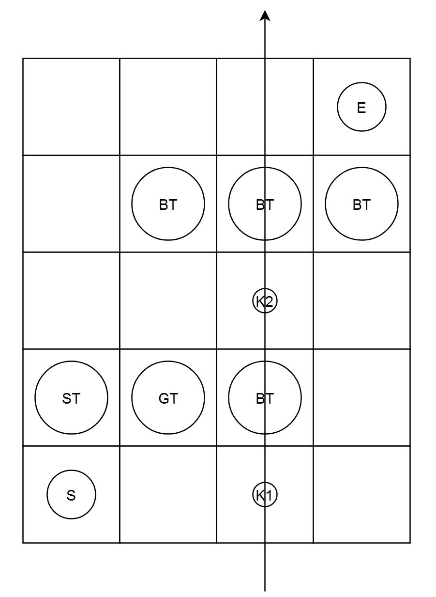

Unzulässig:

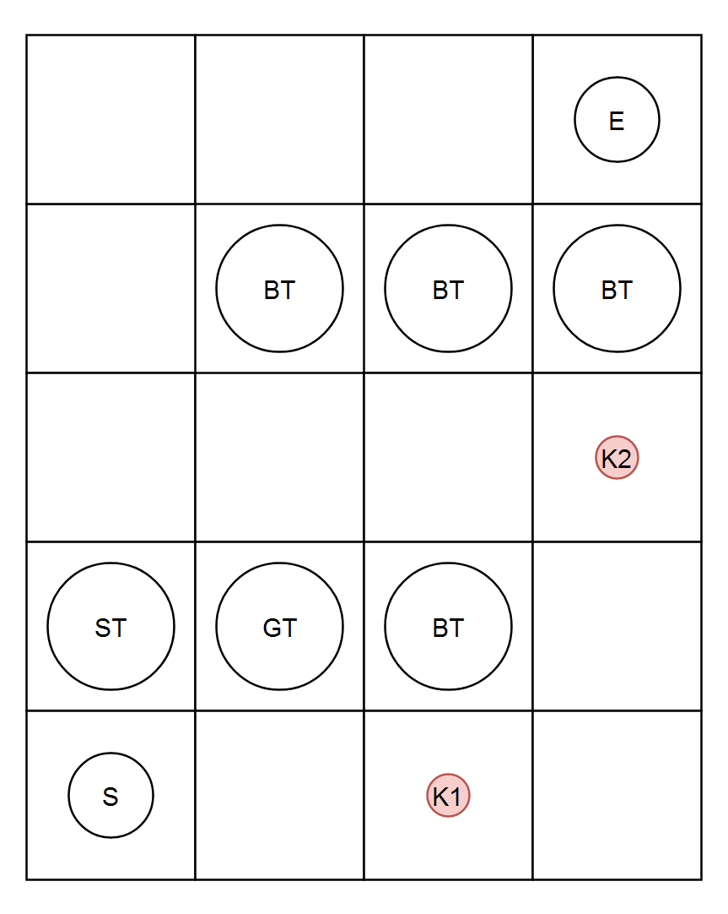

### Feindeinheiten

Feindeinheiten sind Infanterie, Erntemaschinen und Bosseinheiten der Harkonnen, sie versuchen vom Start- bis zum Endportal zu überleben, um das auf dem Weg erbeutete Spice zu klauen. Auf ihrem Weg werden sie von Türmen angegriffen. Diese Angriffe wirken sich durch eine Verringerung der Lebenspunkte oder durch andere Effekte aus, mehr dazu siehe Abschnitt Türme. Feindeinheiten können Türme nicht angreifen. Werden Feindeinheiten zerstört, so bekommt der Spieler je nach Stärke der Feindeinheit Spice auf sein Konto gutgeschrieben, welches für das Bauen von Türmen investiert werden kann.

#### Infanterie

Die Infanterieeinheiten sind nicht besonders widerstandsfähig, aber es handelt sich hierbei um sehr schnelle Einheiten.

#### Erntemaschine

Sehr zähe, aber auch sehr langsame Gegnereinheit.

#### Bosseinheit

Noch mehr Lebenspunkte als eine Erntemaschine, langsamer als Infanterie, aber deutlich schneller als Erntemaschine.

#### Wegfindung

Feindeinheiten können sich nach rechts, links, oben und unten nicht aber Diagonal bewegen. Es wird immer der ideale Laufweg gewählt. Der ideale Laufweg ist der kürzeste Laufweg, es wird nicht berücksichtigt, ob dieser auch der am wenigsten schädliche Laufweg ist. Gibt es mehr als einen idealen Laufweg durch das Spielfeld, so ist sicherzustellen, dass ein Laufweg auf eine deterministische Art und Weise gewählt wird. Es muss immer mindestens ein Laufweg zwischen Start- und Endportal existieren.

### Wellen

Ein Spieldurchlauf besteht aus mehreren Gegnerwellen. Diese Gegnerwellen sind beliebig definierbar, aber es bietet sich an, die Wellen in einer aufsteigenden Schwierigkeit zu definieren.

Es gibt eine endliche Anzahl an Wellen.

Ist eine Welle vollständig besiegt oder sind die restlichen Feindeinheiten über das Endportal entkommen, dann kommt mit einem zeitlichen Versatz die nächste Welle, außer der Spieler hat alle Lebenspunkte verloren, mehr dazu im Abschnitt Sieg und Niederlage.

Vor der ersten Welle und zwischen zwei Wellen können Türme gebaut werden, ansonsten nicht. Baut man den ersten Turm, so beginnt der Countdown zur ersten Welle.

### Sieg und Niederlage

Der Spieler hat eine endliche Anzahl an Lebenspunkten. Der Spieler verliert Lebenspunkte durch Feindeinheiten, die ein Endportal erreichen.

Der Spieler verliert, wenn die Lebenspunkte auf null gesunken sind.

Der Spieler gewinnt, wenn die letzte Welle besiegt wurde.

## Vorgaben zum Entwicklungsprozess

Die Implementierung muss in **Einzelarbeit** erfolgen.

Das Projekt muss in einem Git Repository auf [gitlab.informatik.uni-ulm.de](https://gitlab.informatik.uni-ulm.de) versioniert werden.

Der Quellcode muss sinnvoll und ausführlich dokumentiert werden.

Es wird eine Abnahme des Projekts erfolgen, Ihr Tutor / Ihre Tutorin wird Ihnen eventuell gezielt Fragen zu Ihrem Quellcode stellen. Sie müssen in der Lage sein, diese Fragen zu beantworten.

**Eine erfolgreiche Abnahme des Einzelprojekts ist Voraussetzung zur Teilnahme am zweiten Teil des Softwaregrundprojekts (Sopra).**

